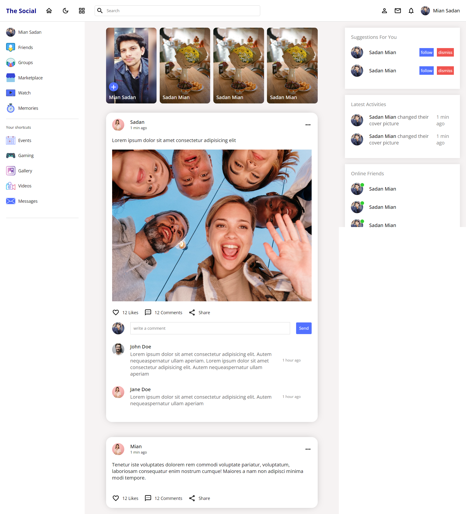
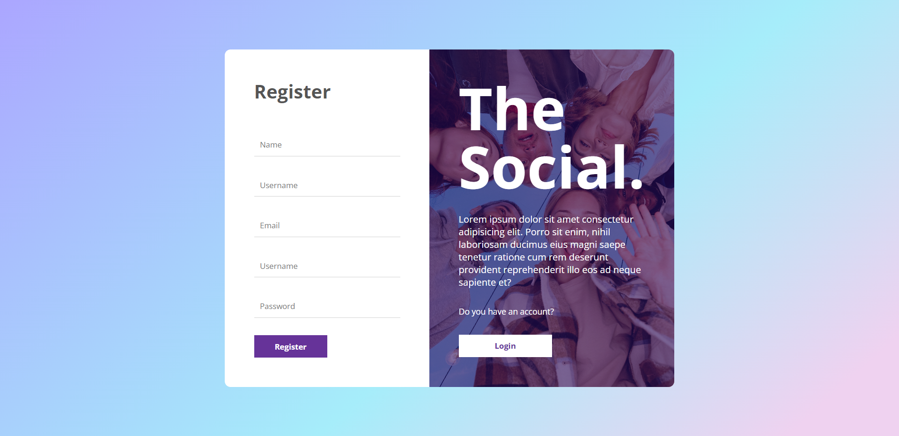
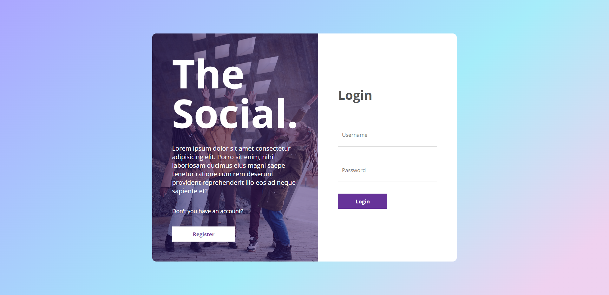
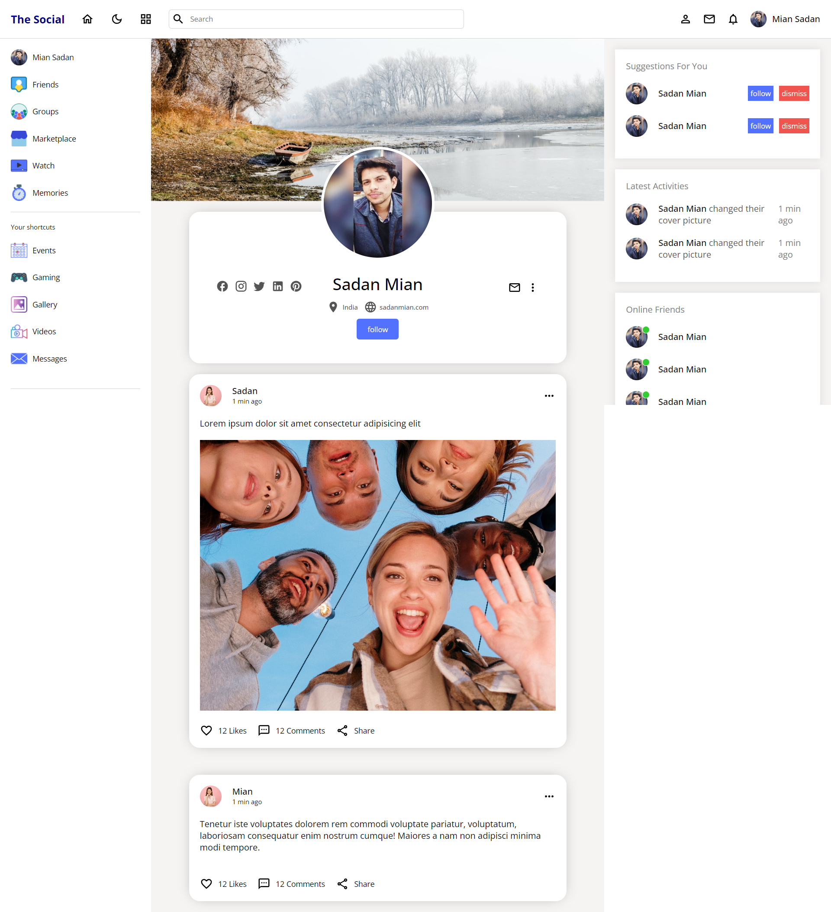
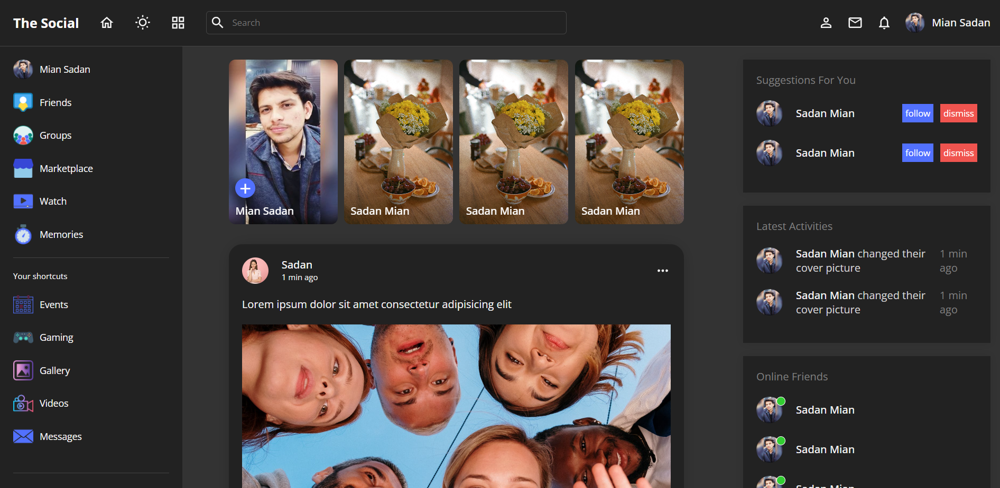

# The Social - React Social Media Clone



Welcome to The Social, a front-end clone of a social media platform built using React. This project includes essential features such as user registration, login, a home feed, and user profiles. Additionally, the clone offers a dark mode functionality for enhanced user experience.

## Table of Contents

- [Introduction](#the-social---react-social-media-clone)
- [Features](#features)
- [Screenshots](#screenshots)
- [Installation](#installation)
- [Usage](#usage)
- [Contributing](#contributing)

## Features

- **Register Page:** Allows new users to create an account by providing necessary details.
- **Signin Page:** Enables registered users to log into their accounts.
- **Home Page:** Displays a feed of posts from various users.
- **Profile Page:** Provides users with a profile overview, including their posts and information.
- **Dark Mode:** Offers a dark mode feature for a more comfortable viewing experience in low-light conditions.

## Screenshots


_Home Page_


_Register Page_


_Signin Page_


_Profile Page_


_Dark Mode_

## Installation

1. Clone the repository using the following command:

   ```bash
   git clone https://github.com/sadanmian/Social-Media-App.git
   ```

2. Navigate to the project directory:

   ```bash
   cd Social-Media-App
   ```

3. Install the required dependencies:

   ```bash
   npm install
   ```

## Usage

1. Start the development server:

   ```bash
   npm start
   ```

   This will launch the website in your default web browser. You can access it at `http://localhost:3000`.

2. Navigate through the different pages using the navigation links provided.

3. Register an account or log in to start exploring the social media clone.

4. Browse the home feed, create posts, and view user profiles.

5. Toggle the dark mode feature for a different viewing experience.

## Contributing

Contributions are welcome! If you'd like to contribute to this project, please follow these steps:

1. Fork the repository.
2. Create a new branch for your feature or bug fix.
3. Make your changes and test them thoroughly.
4. Commit your changes with clear and concise commit messages.
5. Push your changes to your forked repository.
6. Create a pull request explaining your changes and their purpose.
